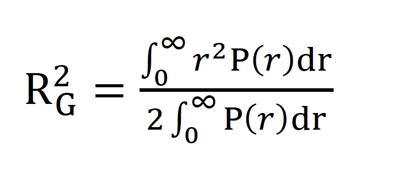

# micelle_radius_of_gyration
Determine the radius of gyration for simulations of dodecylphosphocholine micelles. The radius of gyration is computed for classes of micelles which are defined by a range of aggregation numbers. The script returns the average radius of gyration for micelles in the simulation which fall into each range of aggregation numbers. The method of calculation uses the pair distance function of all intracluster atomic pair distances. The radius of gyration is defined as the second moment of the pair distance function. 

# 

References:

1. Hammouda, B. Probing Nanoscle Structure - SANS Toolbox: Small-Angle Neutron Scattering Polymers Complex Fluids Biology Materials Science. (2016).

2. Hasko Paradies, H. Shape and size of a nonionic surfactant micelle. Triton X-100 in aqueous solution. The Journal of Physical Chemistry 84, 599–607 (1980).

3. Guinier, A., Fournet, G. & Walker, C. B. SCATTERING OF X-RAYS. (1955).
